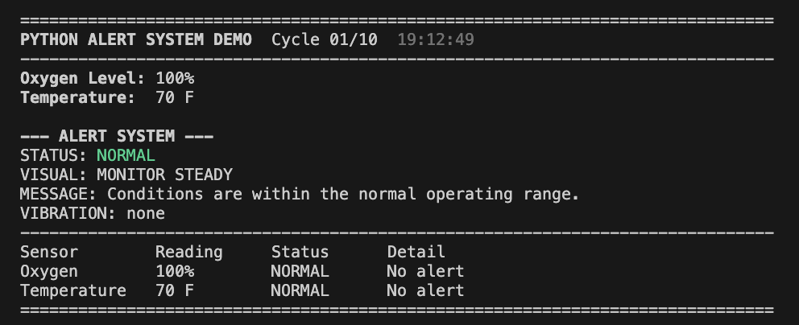
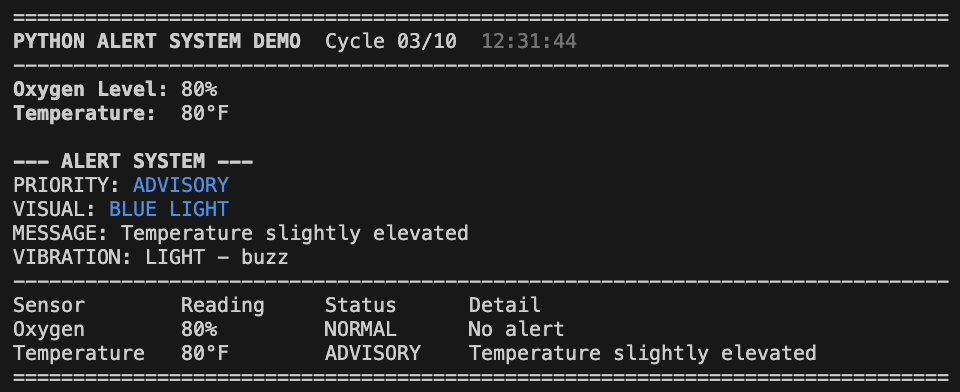
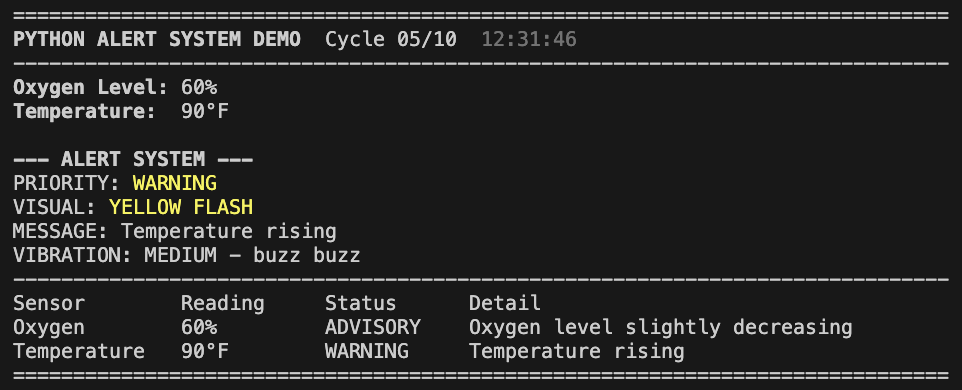
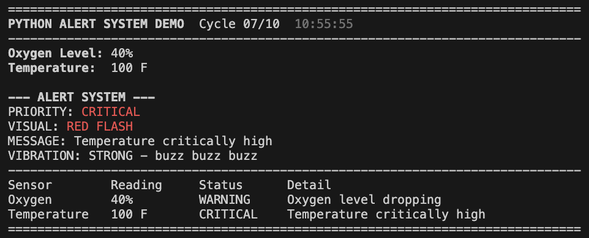

# Multimodal Alert System (Sound-Independent Safety)
**Redesigning alerts for environments where sound fails.**

Most safety systems rely on sound, but sound is often the first thing to fail in high-risk environments. 

This system removes audio entirely and replaces it with visual and vibration-based alerts, creating a more direct and reliable way for humans to detect and respond to critical conditions in high-risk environments like space missions, industrial workspaces, and Deaf-centered systems.

## Live Demo
View the interactive system here:
https://bere-ai.github.io/multimodal-alert-system/

## What this is
I built this as a sound-free alert system for environments where traditional audio alarms don't work well.

Instead of relying on sound, it uses visual signals and vibration patterns to communicate important information clearly, especially for Deaf users or in high-noise environments. 

## Why it matters
As a Deaf woman, I was raised to believe I could do anything, but I also grew up in systems that weren't designed with me in mind.

I once dreamed of becoming an astronaut, but I learned quickly that there was no clear path for someone like me. Not because of ability, but because critical systems-like alert and communication-depend heavily on sound. 

That realization isn't just personal-it's systemic.

When safety systems rely on a single sensory channel, they create limitations not only for Deaf individuals, but for anyone in environments where sound becomes unreliable—such as space missions, high-noise industrial settings, or high-stress conditions.

This project explores a different approach.

By removing audio as a dependency and designing alerts through visual and haptic feedback, this system creates a more inclusive and reliable way for humans to detect and respond to critical situations.

The goal isn't just to build a tool-it's to challenge an assumption:
That sound must be the primary way we communicate urgency.

When we redesign how systems communicate, we don't just improve safety—we redefine who is able to participate in them.


## How it works
The system monitors simulated conditions:
  - Oxygen levels
  - Temperature

It evaluates them using a priority-based system:
  - Advisory → early priority
  - Warning → medium priority
  - Critical → high priority

Each alert triggers:
  - A visual signal (color-based output)
  - A vibration pattern (light/medium/strong)
  - A clear message

If multiple conditions occur at once, the system prioritizes the most critical one.

## Example scenario
In a high-risk environment (like a spacecraft or industrial setting)

If oxygen levels drop:
  - A RED VISUAL ALERT activates
  - A STRONG VIBRATION PATTERN is triggered
  - A clear warning message is displayed

## Demo

Below is a live terminal simulation showing how the system responds to changing environmental conditions.
## Screenshots
### Normal


### Advisory


### Warning


### Critical


No sound is required - all alerts are communicated through visual and haptic signals.

## Design Principles
This system is built on three core ideas:

- **Redundancy over reliance** - Safety should not depend on a single sensory channel.
- **Clarity under stress** - Alerts must be instantly readable in high-pressure environments.
- **Accessibility by design** - Systems should work for more people, not exclude them.

These principles guide how alerts are structured, prioritized, and communicated.

## How to run

```bash
python3 main.py
```

Optional:

```bash
python3 main.py --delay 0
python3 main.py --cycles 5
```

## Project structure
  - main.py → entry point
  - alert_system/engine.py → core logic
  - alert_system/models.py → data structures
  - alert_system/console.py → output formatting
  - alert_system/simulator.py → environment simulation

## Future direction
  - Connect to real sensors
  - Add wearable vibration devices
  - Expand to multi-user alert systems
  - Explore predictive alerting with AI

## Author
Berenice Alvarez-Caballero (Bere)

Interested in accessibility, systems design, and human-centered AI
